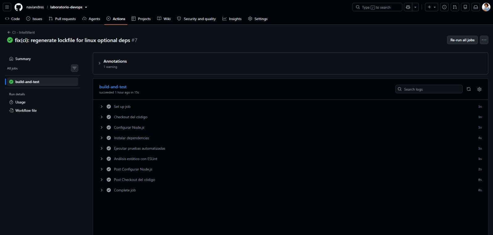
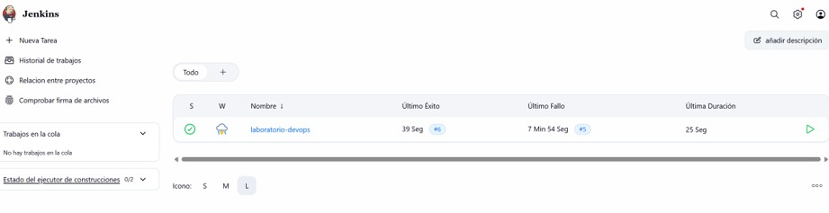
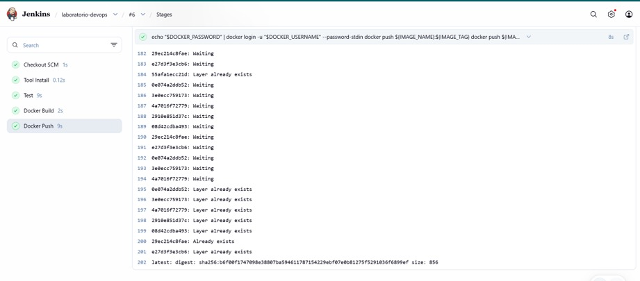

# Documentación Técnica — Laboratorio DevOps CI/CD

## 1. Descripción de la solución

La solución consiste en una aplicación web de demostración (**Intellillent**), servida por
Express en Node.js, acompañada de dos pipelines de automatización:

- **Pipeline de integración continua (CI)** con **GitHub Actions**: se ejecuta
  automáticamente ante cada `push` o `pull request` sobre la rama `main` y valida que el
  código instala dependencias, pasa las pruebas y cumple el análisis estático.
- **Pipeline de entrega continua (CD)** con **Jenkins**: clona el repositorio, ejecuta las
  pruebas, construye la imagen Docker, la publica en Docker Hub y despliega la aplicación
  en un entorno agnóstico/Kubernetes.

Con ambos pipelines, cada cambio en la rama principal pasa por un flujo completo y
automatizado: validación de calidad (CI) seguida de construcción, publicación y despliegue
(CD), con un mínimo de intervención manual.

## 2. Arquitectura CI/CD

```
        push / pull request (rama main)
                      │
                      ▼
        ┌──────────────────────────────────┐
        │  CI — GitHub Actions             │
        │  .github/workflows/ci.yml        │
        │                                  │
        │  Checkout → Node 24 → npm ci     │
        │  → npm test → npm run lint       │
        └──────────────────────────────────┘
                      │
                      ▼
        ┌──────────────────────────────────┐
        │  CD — Jenkins                    │
        │  Jenkinsfile (declarative)       │
        │                                  │
        │  Clone Repository                │
        │  Test                            │
        │  Build Docker Image              │
        │  Publish Image → Docker Hub      │
        │  Deploy to Kubernetes            │
        └──────────────────────────────────┘
                      │
                      ▼
        Entorno agnóstico (Kubernetes u otro)
```

**Componentes del flujo:**

| Componente | Rol | Artefacto de referencia |
|------------|-----|-------------------------|
| GitHub | Aloja el código fuente y los eventos de `push`/`pull_request` | Repositorio `naviandres/laboratorio-devops` |
| GitHub Actions | Ejecuta la CI (checkout, dependencias, pruebas, lint) | `.github/workflows/ci.yml` |
| Jenkins | Orquesta el CD (clonar, test, build, publicar, desplegar) | `Jenkinsfile` |
| Docker | Empaqueta la aplicación en una imagen reproducible | `Dockerfile` |
| Docker Hub | Registro donde se publica la imagen construida | Stage `Publish Image` del Jenkinsfile |
| Kubernetes / entorno agnóstico | Destino de despliegue parametrizable por variables de entorno (Kubernetes u otro entorno según la configuración) | Stage `Deploy to Kubernetes` |

## 3. Justificación de herramientas

El caso de uso corresponde a una **empresa mediana con entregas frecuentes** y un equipo
técnico reducido. Los criterios de selección fueron: reducir el error manual en las
entregas, dar retroalimentación rápida al equipo de desarrollo, lograr despliegues
reproducibles y mantener un costo de infraestructura acotado.

| Herramienta | Rol | Por qué se eligió |
|-------------|-----|-------------------|
| **GitHub Actions** | CI | El código ya está alojado en GitHub, por lo que la integración es nativa: los triggers de `push`/`pull_request` se configuran en el propio repositorio y no se requiere infraestructura adicional. El marketplace ofrece acciones mantenidas (`actions/checkout@v4`, `actions/setup-node@v4`) y el resultado del pipeline se reporta directamente en el commit/PR, lo que acelera la retroalimentación al equipo. |
| **Jenkins** | CD | Herramienta madura de automatización, estándar en la industria y de amplia adopción en empresas medianas. Soporta pipelines declarative (*pipeline as code*), lo que permite versionar la definición del despliegue junto con el código. Su ecosistema de plugins y su ejecución sobre infraestructura propia la hacen adecuada para orquestar build, publicación y despliegue. |
| **Docker** | Contenedorización | Empaqueta la aplicación y sus dependencias en una imagen reproducible y portable, eliminando la diferencia entre entornos ("funciona en mi máquina"). La misma imagen construida en Jenkins se publica y se consume en el entorno de despliegue, garantizando consistencia. |
| **Docker Hub** | Registro de imágenes | Registro estándar, de bajo costo y ampliamente soportado. Permite publicar la imagen construida por Jenkins y que el entorno de despliegue (Kubernetes u otro) la descargue al desplegar, sin necesidad de montar un registro privado. |
| **Kubernetes** | Plataforma de despliegue objetivo | Se seleccionó como destino de despliegue por su modelo declarativo y agnóstico: la misma definición puede aplicarse en la nube o localmente (minikube/kind). El pipeline lo integra de forma parametrizada (namespace, Deployment y manifiestos configurados por variables de entorno), lo que permite desplegar a Kubernetes u otro entorno según la configuración. |
| **ESLint** | Calidad de código | Análisis estático que detecta errores de estilo y problemas de código sin ejecutarlo. Complementa la suite de pruebas en la fase de CI y eleva la calidad de las entregas frecuentes. |
| **Git / GitHub** | Control de versiones | Aloja el código fuente y las configuraciones de ambos pipelines, de modo que la definición de CI/CD queda versionada y auditable. |

## 4. Pipeline CI — GitHub Actions

**Archivo de referencia:** `.github/workflows/ci.yml`

**Triggers:** el workflow se ejecuta automáticamente ante `push` y `pull_request` sobre la
rama `main`. Esto garantiza que toda integración a la rama principal sea validada antes de
ser aceptada.

**Job `build-and-test`** (runner `ubuntu-latest`), con los siguientes pasos:

| # | Paso | Explicación |
|---|------|-------------|
| 1 | `Checkout del código` (`actions/checkout@v4`) | Clona el repositorio en el runner de GitHub. Es la base de todos los pasos siguientes. |
| 2 | `Configurar Node.js` (`actions/setup-node@v4`) | Instala Node.js 24 y configura la caché de `npm`, acelerando instalaciones posteriores. La versión de Node es la misma que usa el `Dockerfile` (`node:24-alpine`). |
| 3 | `Instalar dependencias` (`npm ci`) | Instala las dependencias exactas declaradas en `package-lock.json`, lo que garantiza instalaciones reproducibles y rápidas (a diferencia de `npm install`). |
| 4 | `Ejecutar pruebas automatizadas` (`npm test`) | Ejecuta la suite de pruebas con Jest + Supertest (`test/app.test.js`), que valida que la página principal responde con código 200 y contiene el nombre de la aplicación. |
| 5 | `Análisis estático con ESLint` (`npm run lint`) | Ejecuta ESLint 9 con la configuración `eslint.config.js` (flat config). Valida estilo y errores de código en `server.js`, `eslint.config.js` y los tests, ignorando `node_modules/` y `public/`. |

El orden de los pasos sigue el criterio de "fallar rápido": si la instalación falla, no se
ejecutan las pruebas; si las pruebas fallan, no se ejecuta el lint como paso posterior.

## 5. Pipeline CD — Jenkins

**Archivo de referencia:** `Jenkinsfile` (declarative)

El pipeline usa `agent any`, la herramienta `nodejs 'Node24'` y define las siguientes
variables de entorno:

| Variable | Valor | Uso |
|----------|-------|-----|
| `IMAGE_NAME` | `naviandres/laboratorio-devops` | Nombre de la imagen en Docker Hub |
| `IMAGE_TAG` | `$BUILD_NUMBER` | Tag versionado (número de build de Jenkins) |
| `KUBE_NAMESPACE` | `default` | Namespace de Kubernetes (parametrizable) |
| `K8S_DEPLOYMENT` | `laboratorio-devops` | Nombre del Deployment a actualizar (parametrizable) |
| `K8S_MANIFESTS` | `k8s/` | Directorio de manifiestos Kubernetes (parametrizable) |

Los parámetros de despliegue tienen valores por defecto para que el pipeline sea ejecutable
sin configuración previa y puedan sobrescribirse en el job de Jenkins (entorno agnóstico).

**Stages:** el pipeline define los stages obligatorios de la rúbrica — clonar el
repositorio, construir la imagen Docker y publicarla en un registro — acompañados de la
validación de pruebas y del despliegue a entorno agnóstico:

| # | Stage | Explicación |
|---|-------|-------------|
| 1 | `Clone Repository` (`checkout scm`) | Clona el repositorio en la revisión exacta configurada en el job. Es la base de todos los stages siguientes y garantiza que el pipeline trabaja sobre el código esperado. |
| 2 | `Test` | Valida la versión de Node (`node -v`), instala dependencias (`npm ci`) y ejecuta la suite de pruebas (`npm test --if-present`). Evita construir y publicar artefactos rotos. |
| 3 | `Build Docker Image` | Construye la imagen con el `Dockerfile` y dos tags: `$BUILD_NUMBER` (tag versionado, usado en producción) y `latest` (alias práctico para desarrollo). Producir siempre un tag versionado permite rollbacks identificables. |
| 4 | `Publish Image` | Publica la imagen en Docker Hub. Las credenciales se leen del credential store de Jenkins (`dockerhub-credentials`), nunca van literales en el archivo. |
| 5 | `Deploy to Kubernetes` | Despliega la aplicación a un entorno agnóstico/Kubernetes parametrizado: aplica los manifiestos definidos en `K8S_MANIFESTS` (`k8s/`) cuando existan en el entorno, actualiza la imagen del `Deployment` con el tag versionado y espera a que el rollout termine. Namespace, nombre del Deployment y directorio de manifiestos se configuran por variables de entorno. |

## 6. Evidencias







## 7. Referencias

- `README.md` — guía de uso y flujo CI/CD del repositorio.
- `.github/workflows/ci.yml` — definición del pipeline CI.
- `Jenkinsfile` — definición del pipeline CD.
- `Dockerfile` — imagen Docker de la aplicación.
- `eslint.config.js` — configuración de análisis estático.
- Repositorio: <https://github.com/naviandres/laboratorio-devops>
