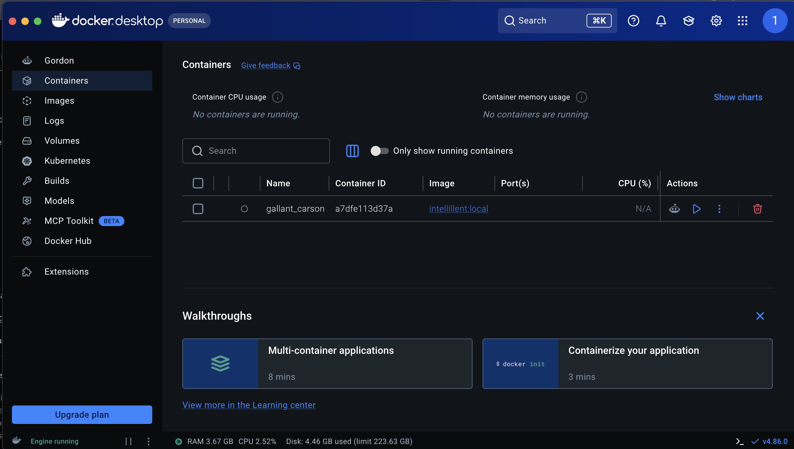
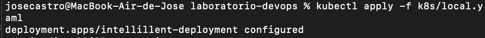
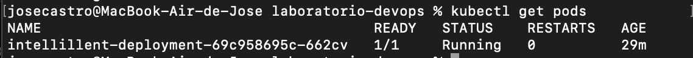
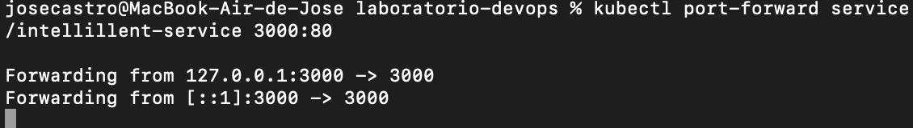
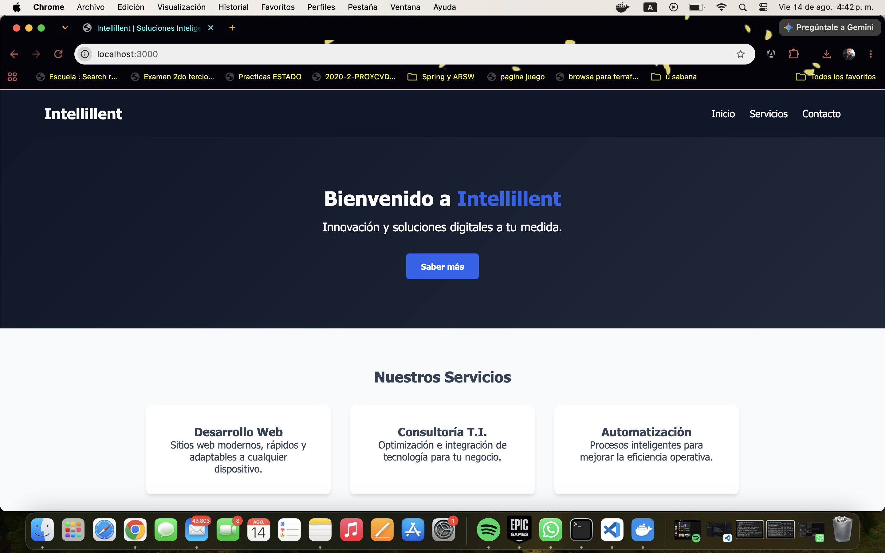
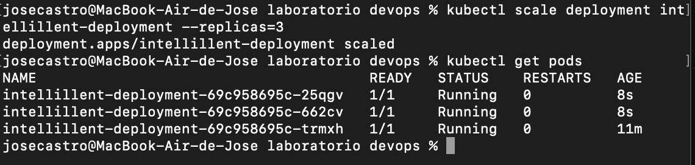

# Evidencia de Laboratorio: Despliegue en Kubernetes (Intellillent)

Este documento contiene el registro de los comandos ejecutados para el despliegue de la aplicación **Intellillent** en un clúster local de Kubernetes (Docker Desktop). Además, incluye las pruebas de resiliencia y escalabilidad que demuestran el valor de orquestar contenedores.

## 1. Construcción de la Imagen Docker

Para que Kubernetes pudiera ejecutar la aplicación, primero empaquetamos el código utilizando el `Dockerfile` optimizado.

```bash
docker build -t intellillent:local .
```


## 2. Aplicación de los Manifiestos de Kubernetes

Se creó el archivo `k8s/local.yaml` que contiene el **Deployment** y el **Service**. Se aplicó al clúster local con el siguiente comando:

```bash
kubectl apply -f k8s/local.yaml
```



Para verificar que el pod (contenedor) se levantó correctamente:

```bash
kubectl get pods
```



## 3. Acceso a la Aplicación (Port-Forwarding)

Debido a configuraciones de red, utilizamos la herramienta de port-forwarding para crear un túnel directo hacia el servicio de Kubernetes.

```bash
kubectl port-forward service/intellillent-service 3000:80
```


> 


## 4. Prueba 1: Resiliencia y Auto-recuperación (Self-healing)

Para demostrar la capacidad de recuperación automática de Kubernetes, forzamos la eliminación del pod activo. Kubernetes detectó la caída e inmediatamente levantó un nuevo pod para garantizar la disponibilidad.

```bash
# Obtener el nombre del pod actual
kubectl get pods

# Eliminar el pod forzadamente (Simulando una caída)
kubectl delete pod <nombre-del-pod>

# Verificar la creación inmediata de un nuevo pod
kubectl get pods
```


## 5. Prueba 2: Escalabilidad Horizontal

Para simular la respuesta a un aumento masivo de tráfico web, escalamos la aplicación de 1 a 3 réplicas simultáneas con un solo comando.

```bash
# Escalar el despliegue a 3 instancias
kubectl scale deployment intellillent-deployment --replicas=3

# Verificar que los 3 pods están corriendo
kubectl get pods
```


